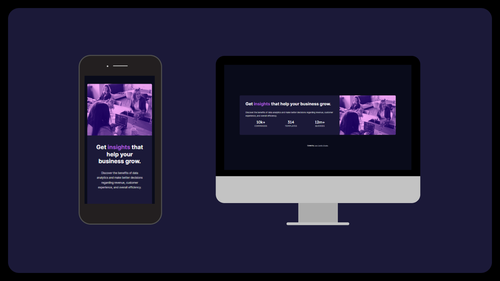

# Make It Real - Stats preview card component

# Make It Real - NAME OF THE PROJECT

This is a solution to the Stats preview card component project of the Make It Real course.

## Table of contents

- [Overview](#overview)
  - [The challenge](#the-challenge)
  - [Screenshot](#screenshot)
- [My process](#my-process)
  - [Built with](#built-with)
  - [What I learned](#what-i-learned)
  - [Continued development](#continued-development)
  - [Useful resources](#useful-resources)
- [Author](#author)
- [Acknowledgments](#acknowledgments)

## Overview

### The challenge

Users should be able to:

- Build a website card based on a design
- Adapt css styling to be responsive

### Screenshot



## My process

To begin with, I set the HTML structure. I kept all tags as semantic as possible. Then, I worked on css styling. I styled mobile first and once mobile version was all set, I added media query for larger devices and a flexbox display to rearange the elements disposition.

### Built with

- Semantic HTML5 markup
- CSS custom properties
- Flexbox
- Mobile-first workflow

### What I learned

I remembered a couple of handy css properties:

```css
.img {
  background-size: cover;
  background-blend-mode: overlay;
}

#container {
  display: flex;
  flex-direction: row-reverse;
  align-content: stretch;
}
```

### Continued development

I need to keep working on flex properties as in some parts of the coding process, I was really doubtful about which property would help me and sometimes got an unwanted result.

### Useful resources

- [A Guide to Flexbox](https://css-tricks.com/snippets/css/a-guide-to-flexbox/) - This helped me to have a better understanding of Flexbox properties.
- [MDN on Media Queries](https://developer.mozilla.org/es/docs/Web/CSS/Media_Queries/Using_media_queries) - This reminded me the media queries syntax.

## Author

- [LinkedIn](https://www.linkedin.com/in/juan-orjuela/)
- [Behance](https://www.behance.net/juan_o)

## Acknowledgments

Special aknowledgments to Laura Esmoris, coding partner on this task, to my bf for lending me his laptop (as mine died in the process) and to [Cristian Moreno](https://github.com/khriztianmoreno), teacher and mentor for supervising our process.
